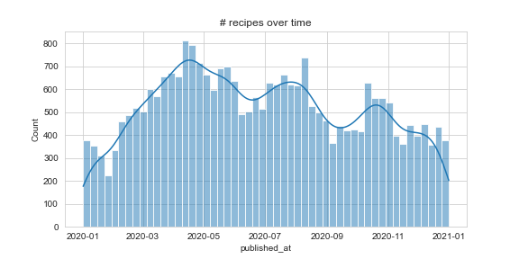

# Python_CheatSheet

- [Python_CheatSheet](#python_cheatsheet)
  - [1. Dataframe Operations](#1-dataframe-operations)
  - [2. Basic Python Stuffs](#2-basic-python-stuffs)
  - [3. Visualization](#3-visualization)

## 1. Dataframe Operations

- Dataframe summary


<details>
<summary>Code</summary>

  ```python

  def summarize_df(df_input):
      """
      Summarized and returns a pandas dataframe denoting the total number of NA/Duplicated values and the percentage of NA/Duplicated values in each column.
      The column names are noted on the index.
      
      Parameters
      ----------
      data: dataframe
      """
      print(df_input.info())
      columnList = df_input.columns.tolist()        
          
      # pandas series denoting features and the sum of their null values
      null_sum = df_input.isnull().sum()# instantiate columns for missing data
      Nullpercent = ( ((null_sum / len(df_input.index))).round(2) )
      
      # pandas series denoting features and the sum of their duplicate value
      nunique_sum = df_input.nunique(dropna = False)
      Duplicatepercent = ( 1 - ((nunique_sum / len(df_input.index))).round(2) )
      
      # concatenate along the columns to create the complete dataframe
      df_NA = pd.concat([null_sum, Nullpercent, nunique_sum, Duplicatepercent], axis=1, keys=['Number of NA', 'Percent NA','Number of Uniques', 'Percent Duplicate'])
      
      return df_NA

  ```

</details>

- Dataframe Selection

```python
recipes_dfUse2 = recipes_dfUse[['counts_x','user_id','User_popularity']]
```


## 2. Basic Python Stuffs

* Def format

<details>
<summary>Code</summary>

  ```python
  def get_jsonparsed_data(url):
      """
      Receive the content of ``url``, parse it as JSON and return the object.

      Parameters
      ----------
      url : str

      Returns
      -------
      dict
      """
      response = urlopen(url, cafile=certifi.where())
      data = response.read().decode("utf-8")
      return json.loads(data)
  ```

</details>


## 3. Visualization

* Histogram



<details>
<summary>Code</summary>

  ```python
  fig = plt.figure(figsize = (8, 4))
sns.histplot(data = recipes_df, 
            x = 'published_at',  kde = True,
            bins = 52, 
            legend = False
)
plt.title('# recipes over time')
# fig.savefig('/content/img/n_recipes_over_time.jpg')

  ```

</details>